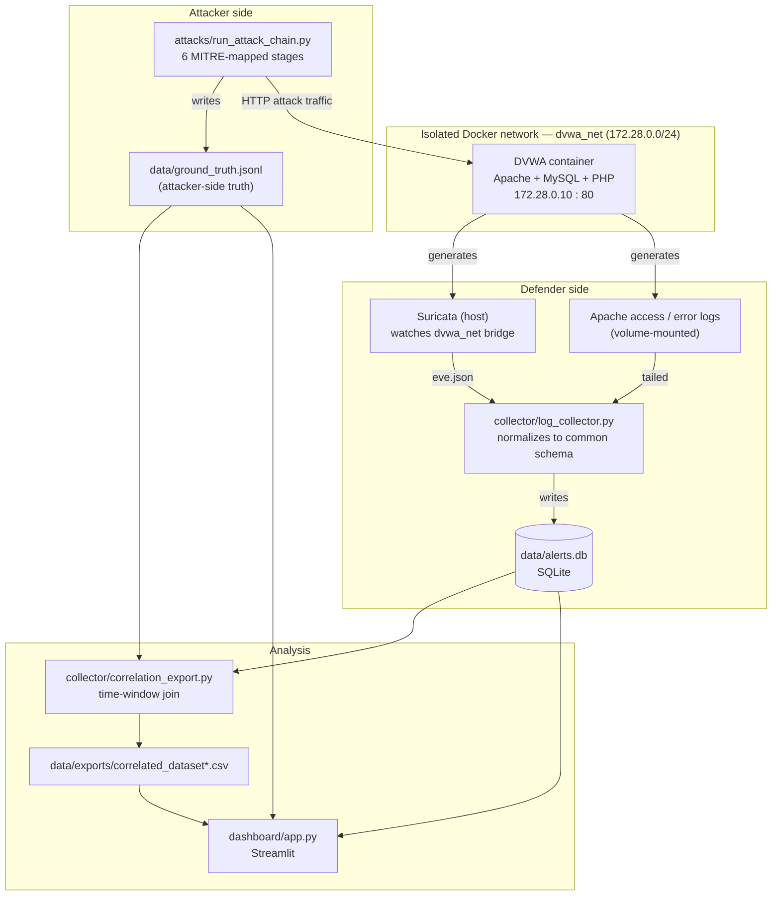
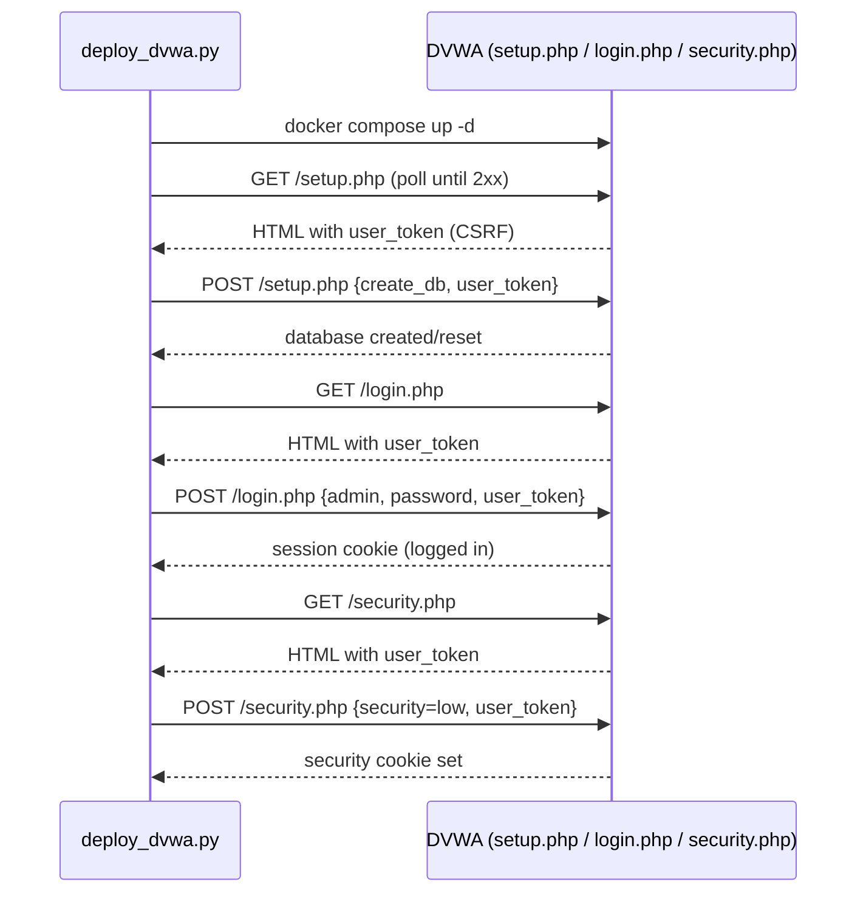

# Kill Chain Runbook

**Complete process documentation for the RL Alert-Correlation Lab**
Repository: [`haaziq070/rl-alert-correlation-`](https://github.com/haaziq070/rl-alert-correlation-) (private)

This document describes, end to end, how the lab supporting the thesis *RL-Based
Adaptive Alert Correlation for Detecting Multi-Stage Cyber Attacks* was designed,
built, deployed, and published — from the first line of `config.py` to the
`git push` that put it on GitHub. It is written to be read as a methodology
chapter/appendix, not just a command list: each phase explains *why* it's built
the way it is, not only *what* to run.

---

## 1. Objective and research framing

Alert-correlation research needs two things real SOC data rarely gives you
cleanly:

1. **Known-good ground truth** — exactly which attack stage happened, when.
2. **Repeatability** — a re-runnable attack chain so many labeled episodes can
   be generated for training and evaluating a correlator.

The lab gets both by keeping attacker and defender strictly separated, with
independent instrumentation, and joining their outputs after the fact:

- **Attack scripts** play the attacker and write their own timestamped ground
  truth, independent of whatever the IDS does or doesn't catch.
- **The collector** plays the defender: it only ever reads Suricata/Apache
  output and has no knowledge of what the attacker did.
- **The correlation export** is the analysis step that joins the two by time
  window, producing the labeled dataset an RL correlator would consume as its
  observation stream and reward signal.

## 2. System architecture



Attacker and defender never share state directly — the only connection is the
target itself (DVWA) and the timestamps both sides independently record. This
is what makes the correlation step a genuine measurement rather than a
tautology.

## 3. Prerequisites and environment

| Requirement | Purpose |
|---|---|
| Linux host + Docker, `docker compose` plugin | Runs DVWA in an isolated, disposable container |
| Python 3.10+ | All scripts (attacks, collector, dashboard) |
| `suricata` (installed by `deployment/setup_suricata.sh`) | Network IDS watching the DVWA bridge |
| `nmap` (optional) | Stage 1 recon; falls back to a pure-Python socket scan if absent |
| `git`, `gh` CLI | Version control and GitHub publishing (Phase 8) |

```bash
git clone <this repo>
cd rl-alert-correlation
python3 -m venv .venv && source .venv/bin/activate
pip install -r requirements.txt   # requests, pandas, streamlit, plotly
```

---

## 4. Phase 1 — Project scaffolding

Everything traces back to two files:

- **`config.py`** — every path, credential, subnet, wordlist, and the MITRE
  ATT&CK stage map lives here. Nothing else hardcodes a host, port, or file
  path, so the whole lab can be retargeted by editing one file.
- **`logging_setup.py`** — the pipeline's *own* operational logging (not the
  alert data), modeled deliberately on Log4j/Log4j2 rather than ad-hoc
  `print()` calls, because a multi-threaded collector without structured,
  leveled, per-component logs is nearly impossible to debug once something
  goes wrong at 2am mid-experiment. See Phase 5 for the design.

Directory layout established at this stage:

```
config.py, logging_setup.py, docker-compose.yml, requirements.txt
deployment/     DVWA + Suricata bring-up
attacks/        the six attack-chain stages + orchestrator
collector/      log tailing, schema, correlation export
dashboard/      Streamlit visualization
scripts/        one-shot orchestration
data/           generated at runtime (gitignored)
```

## 5. Phase 2 — DVWA deployment

`docker-compose.yml` runs a single `vulnerables/web-dvwa` container (bundled
Apache + MySQL + PHP) on a dedicated bridge network `dvwa_net`
(`172.28.0.0/24`, DVWA fixed at `172.28.0.10`), with the Apache log
directories volume-mounted out to `data/dvwa_logs/` so the host-side collector
can tail them without reaching into the container.

`deployment/deploy_dvwa.py` then drives DVWA into a known state entirely by
HTTP, mirroring what a human would do by hand in the setup wizard:



DVWA's CSRF token (`user_token`) is scraped by regex from every form before
the corresponding POST — every DVWA-facing script in the repo
(`attacks/dvwa_session.py` included) repeats this same fetch-token-then-post
pattern, since DVWA regenerates the token on every page load.

Security level defaults to **low**: the attack scripts are written and
verified against low's behavior (unsanitized SQL concatenation, unrestricted
uploads, plaintext brute-force responses). Medium/high are a deliberate
extension exercise — harden the target and observe how both the exploit
payloads and the resulting alert signatures need to change.

## 6. Phase 3 — Network IDS setup (Suricata)

Suricata runs on the **host**, not in a sidecar container — simpler, and it
still sees all `dvwa_net` traffic because Docker bridge interfaces are
visible from the host. `deployment/setup_suricata.sh`:

1. Installs Suricata via `apt` if missing.
2. Resolves the actual bridge interface for `dvwa_net`
   (`br-<network-id-prefix>`) via `docker network inspect`.
3. Installs `deployment/suricata/local.rules` — custom rules, SIDs
   `9000001`–`9000050`, one family per attack stage (recon, brute force,
   SQLi, upload/webshell, C2/discovery, exfiltration), each tagged with its
   MITRE tactic/technique in rule metadata.
4. Points `HOME_NET` at the DVWA subnet and redirects `eve.json` into
   `data/suricata/` so the collector can read it without root.

These rules are intentionally simple, high-recall signatures tuned to this
lab's exact attack scripts — the goal is a reliable labeled alert stream for
correlation research, not a demonstration of production IDS engineering.

## 7. Phase 4 — The multi-stage attack chain

`attacks/run_attack_chain.py` runs six stages in order, once per "episode."
Each stage is its own script; each maps to a MITRE ATT&CK tactic/technique
declared centrally in `config.STAGE_MITRE_MAP`:

| # | Stage | Tactic | Technique | DVWA module | What it does |
|---|-------|--------|-----------|--------------|---------------|
| 1 | Recon | TA0043 | T1595 | — | Port scan (nmap or socket fallback) + content discovery over a built-in path wordlist |
| 2 | Brute force | TA0006 | T1110 | `vulnerabilities/brute/` | Credential-stuffs a small built-in username/password list |
| 3 | SQL injection | TA0006 | T1190 | `vulnerabilities/sqli/` | UNION-based injection dumping `user`/`password` from the `users` table |
| 4 | Upload → RCE | TA0002 | T1505.003 | `vulnerabilities/upload/` | Uploads a minimal PHP webshell (`<?php system($_GET['cmd']); ?>`), verifies it's live |
| 5 | C2 / discovery | TA0007 | T1082 | planted webshell | Runs `whoami`, `id`, `uname -a`, etc. through the webshell |
| 6 | Exfiltration | TA0010 | T1041 | planted webshell | Reads `/etc/passwd` through the webshell, saves it locally under `data/exfiltrated_data/` |

Every stage is wrapped in `GroundTruth.stage(name, details)`
(`attacks/dvwa_session.py`), a context manager that writes a `stage_start`
and `stage_end` record — each with an ISO8601 UTC timestamp, MITRE mapping,
and a `run_id` unique to that episode — to `data/ground_truth.jsonl`. This is
the authoritative label file everything downstream joins against; it does
not depend on the IDS having caught anything.

```bash
python3 attacks/run_attack_chain.py --episodes 5 --delay 5
```

## 8. Phase 5 — Structured log collection

`collector/log_collector.py` runs one daemon thread per source
(`tail-suricata`, `tail-apache-access`, `tail-apache-error`) plus a single
`db-writer` thread draining a shared queue into SQLite, so writes are
serialized without the tailers blocking on I/O contention.

**Operational logging design.** The pipeline's own runtime logging — startup,
parse errors, throughput, exceptions; *not* the alert data itself — is
modeled on Log4j/Log4j2 rather than Python's default unstructured logging,
via `logging_setup.py`:

- **Named, hierarchical loggers** per component (`collector.suricata`,
  `collector.apache_access`, `collector.writer`, …), each carrying its own
  thread name automatically.
- **Two appenders**: a console appender using a Log4j `PatternLayout`-style
  line (`timestamp [thread] LEVEL logger - message {extras}`), and a rotating
  file appender (`RollingFileAppender` equivalent — 10 MB × 5 backups) that
  always writes structured JSON, one record per line, to
  `data/logs/collector.log`.
- **MDC** (Mapped Diagnostic Context): `log_context(run_id=...)` binds
  key/value pairs to every log record emitted inside a `with` block, the same
  way Log4j's `ThreadContext` tags a request's log lines without threading
  the value through every call site.

```
2026-08-18T12:34:56.789Z [tail-suricata] INFO  collector.suricata - alert ingested {'signature': '...', 'category': 'sqli'}
```

```json
{"timestamp": "2026-08-18T12:34:56.789Z", "level": "INFO", "logger": "collector.writer", "thread": "db-writer", "message": "alert batch progress", "data": {"total_written": 25}}
```

**Verification found two real bugs, fixed during this phase:**

1. *Uncommitted writes during quiet gaps.* The writer originally only called
   `conn.commit()` immediately after inserting an alert. During a lull in
   traffic (no new alert arriving), the queue-read loop sat blocked without
   ever re-checking the commit timer — so rows could remain uncommitted, and
   therefore invisible to `correlation_export.py` reading from a separate
   connection, indefinitely. Fixed by committing on a ~1s tick regardless of
   whether an alert just arrived.
2. *Apache alerts timestamped with "now" instead of the log's own time.* The
   original code stamped every Apache-sourced alert with
   `time.strftime(...)` at *processing* time. This silently breaks
   `--from-start` replay of historical logs (and any live processing lag)
   because the alert's recorded time no longer matches when it actually
   happened, which breaks the ground-truth time-window join. Fixed by parsing
   the timestamp embedded in each Apache access/error log line instead.

Both were caught by round-tripping synthetic log data through the collector
and the correlation export before trusting the pipeline against a live
DVWA/Suricata run — worth doing the same after any change to either script.

## 9. Phase 6 — Correlation export

`collector/correlation_export.py` performs the actual measurement:

1. Loads `ground_truth.jsonl`, mirrors it into a `ground_truth` table in
   `alerts.db` (for the dashboard's convenience).
2. Pairs each `stage_start`/`stage_end` into a time window per
   `(run_id, stage)`, padded ±3 seconds by default (`--pad`) to absorb
   network/processing jitter.
3. For every alert in `alerts.db`, finds the first matching stage window (if
   any) and labels it — `matched_stage`, `mitre_tactic`, `mitre_technique` —
   or `unlabeled` if no ground-truth stage was active at that timestamp.
4. Writes `data/exports/correlated_dataset_<run_id|all>.csv` and logs a
   structured per-stage / per-(source,category) summary — a naive
   time-window correlator, and the first baseline an RL approach needs to
   beat.

```bash
python3 collector/correlation_export.py --run-id <run_id> --pad 5
```

## 10. Phase 7 — Visualization dashboard

`dashboard/app.py` (Streamlit) reuses `correlation_export`'s join logic
directly rather than duplicating it, so the dashboard and the exported CSV
can never disagree about what's correlated to what. Three views:

- **Timeline** — every alert plotted by source lane and time, with shaded
  bands for each ground-truth stage window drawn behind them, so clustering
  (or its absence) is visible at a glance.
- **Correlation matrix** — a heatmap of true stage vs. which alert category
  actually fired: the "confusion matrix" for the baseline correlator.
- **Raw alert table**, filterable by run, category, and source.

Category colors are fixed and semantic (not decorative): recon=blue,
bruteforce=orange, sqli=aqua, upload_rce=yellow, c2_discovery=magenta,
exfiltration=red, unlabeled=neutral gray — chosen from a categorical palette
validated for colorblind-safe adjacency, reused consistently between the
dashboard and this document's stage tags.

```bash
streamlit run dashboard/app.py
```

---

## 11. Phase 8 — Version control and GitHub publishing

This phase is documented in full because the friction encountered here is
itself useful methodology for anyone repeating the process.

**Local repository.**

```bash
cd rl-alert-correlation
git init
git add .gitignore README.md attacks/ collector/ config.py dashboard/ \
        deployment/ docker-compose.yml logging_setup.py requirements.txt scripts/
git commit -m "Add DVWA multi-stage attack chain lab for RL alert-correlation thesis"
```

`.gitignore` excludes `data/` entirely (generated logs, the SQLite DB,
ground truth, exports) — the repo ships the *pipeline*, not any one run's
output.

No git identity existed on the build machine, so a **repo-local** identity
was set (`git config user.name` / `user.email`, no `--global`) rather than
touching global config.

**Authentication.** The build environment had no `gh` CLI, no SSH key, and
no credential helper. The path taken:

1. Install the GitHub CLI (`apt-get install gh`).
2. Authenticate with a GitHub Personal Access Token (PAT) via
   `gh auth login --with-token` (token piped over stdin, never passed as a
   command-line argument, to avoid it landing in shell history or a process
   listing).
3. `gh auth setup-git` to make plain `git push`/`pull` use the same
   credential.

**Lesson: fine-grained PAT scoping.** The first PAT used could authenticate
`gh` but couldn't create a repository (`gh repo create` failed —
`Resource not accessible by personal access token`) and, after the repo was
created manually on GitHub, still couldn't push
(`Write access to repository not granted`, HTTP 403). Fine-grained PATs
require the target repository to be explicitly selected in the token's
repository-access list **and** the `Contents` permission set to
**"Read and write"** — a repo owner's own admin rights on the repository do
not substitute for the token's own scoped permissions. This was confirmed by
probing the Contents API directly with `curl` (bypassing `git`/`gh`
entirely) to isolate the token itself as the cause before touching any more
git state. A **classic PAT with the `repo` scope** avoids this class of
issue entirely and was used for the final push.

**Lesson: unrelated histories after a live permission probe.** Verifying the
working token's write access was done via a real `PUT`/`DELETE` against the
GitHub Contents API (create then remove a probe file) rather than assuming —
which left two throwaway commits on the remote `main`. Since the local repo
had its own single root commit with no shared history, a plain `git push`
correctly refused as a non-fast-forward. Resolution: `git push --force`,
justified here specifically because the only remote content was the probe
commits just created moments earlier as part of this same verification step
— not collaborator work — and the tree was root-commit-only.

```bash
git remote add origin https://github.com/haaziq070/rl-alert-correlation-.git
git branch -M main
git push --force -u origin main
```

**Credential hygiene.** Every PAT that passed through the chat used to drive
this session was treated as compromised the moment it was pasted (chat
history may be logged/retained) — the two that failed were revoked
immediately on GitHub, and the working token was flagged for rotation once
publishing was confirmed successful, independent of whether it technically
still worked.

---

## 12. Data schema reference

**`data/ground_truth.jsonl`** — one JSON object per line:

| Field | Meaning |
|---|---|
| `run_id` | Unique per attack-chain episode |
| `event` | `stage_start` \| `stage_end` \| `note` |
| `stage` | One of the six stage names in §7 |
| `mitre_tactic` / `mitre_technique` | From `config.STAGE_MITRE_MAP` |
| `timestamp` | ISO8601 UTC |
| `duration_seconds` | Only on `stage_end` |
| `details` | Stage-specific payload (varies) |

**`data/alerts.db`** (SQLite):

- `alerts` — normalized alerts from all sources: `id`, `timestamp`, `source`
  (`suricata` \| `apache_access` \| `apache_error` \| `apache_behavioral`),
  `category`, `signature`, `severity`, `src_ip`, `dest_ip`, `dest_port`,
  `proto`, `raw`.
- `ground_truth` — the JSONL above, mirrored in for the dashboard's queries.

**`data/exports/correlated_dataset_*.csv`** — one row per alert:
`alert_id`, `alert_timestamp`, `alert_source`, `alert_category`,
`alert_signature`, `severity`, `src_ip`, `dest_port`, `matched_run_id`,
`matched_stage`, `mitre_tactic`, `mitre_technique`.

**`data/logs/*.log`** — the pipeline's own structured operational logs
(JSON lines, §8), separate from the alert data above.

## 13. From correlation baseline to the RL formulation

This lab produces the labeled event stream; the RL correlator itself is
separate, future work. The intended framing, given what's exported here:

- **Episode** = one `run_id` (one full attack-chain run).
- **Observation / state** = a sliding window of recent `alerts` rows
  (category, source, severity, src/dest, inter-alert time deltas).
- **Action** = correlate the incoming alert into an existing attack-chain
  cluster, start a new one, or mark it as noise.
- **Reward** = shaped from `matched_stage` in the correlated export during
  training — correct grouping against the six-stage MITRE-mapped ground
  truth earns reward; grouping `unlabeled` noise with a real chain is
  penalized.
- **Baseline to beat** = the naive time-window correlator in §9 — its
  per-stage precision/recall (from the console summary) is the number an RL
  approach needs to improve on.

## 14. Repository reference

```
config.py                    Central config (paths, DVWA URL/creds, subnet, wordlists, MITRE map)
logging_setup.py               Log4j-style structured logging (pattern + JSON layouts, MDC context)
docker-compose.yml            DVWA container on the isolated dvwa_net bridge
deployment/
  deploy_dvwa.py               Bring up + configure DVWA (reset DB, login, security level)
  setup_suricata.sh             Install/configure/run Suricata on the host
  suricata/local.rules           Custom rules, one family per attack stage
attacks/
  dvwa_session.py                DvwaSession (login/CSRF) + GroundTruth (JSONL logger)
  stage1_recon.py .. stage6_exfiltration.py    One script per kill-chain stage
  run_attack_chain.py             Orchestrator (--episodes, --delay)
collector/
  schema.py                        Alert dataclass + SQLite schema
  log_collector.py                  Tails Suricata/Apache -> data/alerts.db
  correlation_export.py              Time-window join -> labeled CSV + summary
dashboard/
  app.py                             Streamlit: timeline, correlation heatmap, alert table
scripts/
  run_full_scenario.sh                One-shot: deploy -> collect -> attack -> export
docs/
  METHODOLOGY.md                       This document
data/                                  Generated at runtime (gitignored)
```

## 15. Appendix — troubleshooting log

| Issue | Cause | Resolution |
|---|---|---|
| `apt-get install gh` hung on a whiptail dialog | Unrelated pending kernel-upgrade debconf prompt on the build host | Non-interactive install still completed; confirmed via `gh --version` rather than trusting the noisy output |
| DB writer silently dropped rows during quiet periods | Commit only happened right after an insert, not on a timer | Commit on a ~1s tick every loop iteration, insert or not (§8) |
| Correlated alerts showed as `unlabeled` despite occurring inside a valid ground-truth window | Apache-sourced alerts were stamped with wall-clock "now" instead of the log line's own timestamp | Parse the Apache access/error log's embedded timestamp (§8) |
| `gh repo create` → `Resource not accessible by personal access token` | Fine-grained PAT lacked `Administration: write` | Created the repo manually via the GitHub web UI instead |
| `git push` → `Write access to repository not granted` (403) | Fine-grained PAT's `Contents` permission wasn't `Read and write`, or wasn't scoped to this repo | Verified independently via a direct Contents-API `curl` probe; switched to a classic PAT with `repo` scope |
| `git push` rejected as non-fast-forward | Live API probe left two commits on remote `main` with no shared history with the local root commit | `git push --force`, justified because the only remote content was the probe commits from the immediately preceding verification step |

---

*This document is generated to accompany the repository at the commit tagged
in `git log`; regenerate or amend it alongside any structural change to the
pipeline it describes.*
